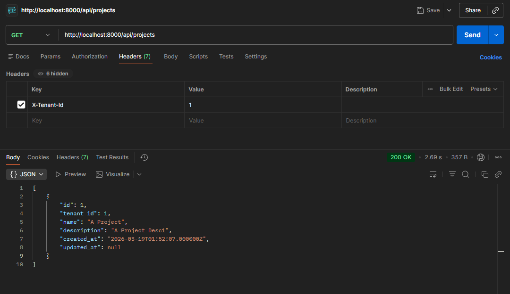
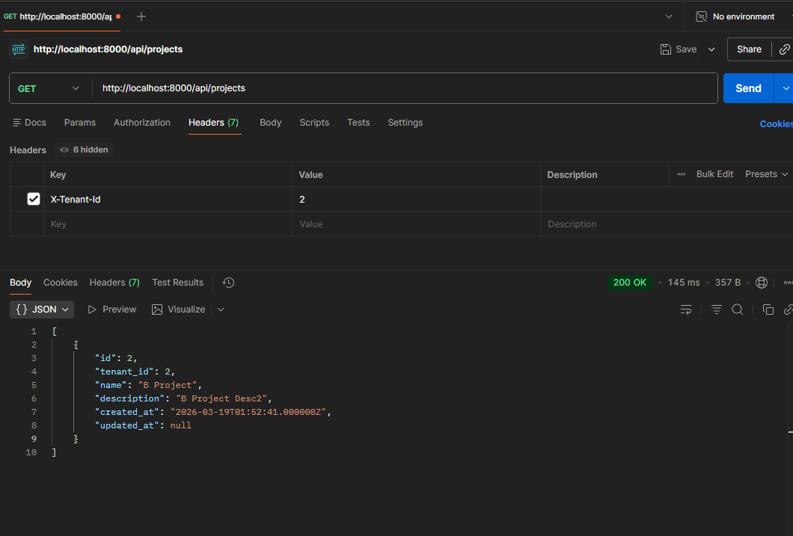
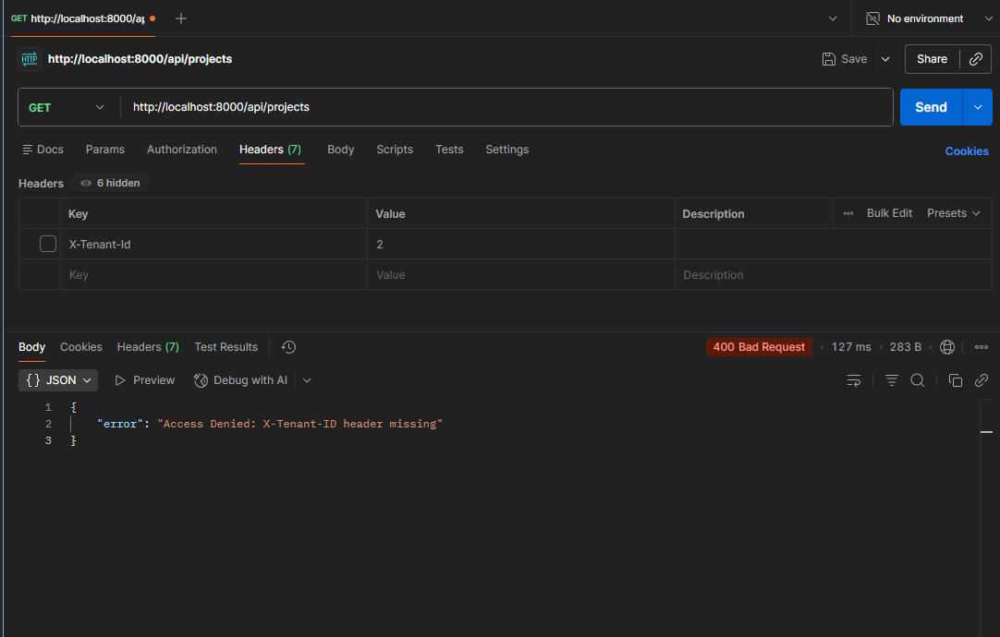

---

## [TR] Vaka Çalışması: B2B SaaS Sistemlerinde Ölçeklenebilir Çoklu Kiracı (Multi-Tenant) Mimarisi

**Proje Özeti:** Bu proje, tek bir ilişkisel veritabanı altyapısı (Single Database, Multi-Schema) üzerinden birden fazla müşteriye (Tenant) sıfır veri sızıntısı (Zero Data Leak) garantisiyle hizmet sunan bir SaaS backend mimarisi prototipidir.

### Problem Tanımı ve Sistem Kısıtlamaları
Büyüme evresindeki B2B SaaS platformlarının karşılaştığı en büyük teknik darboğaz, müşteri verilerinin birbirine karışmasıdır. İzolasyonun Controller seviyesinde manuel `where('tenant_id', $id)` sorgularıyla yapılması, insan hatasına açık (error-prone) bir yapıdır ve katastrofik güvenlik ihlallerine zemin hazırlar. Ayrıca, uzun süre çalışan (long-running) sunucu mimarilerinde (örn: Laravel Octane), statik veya singleton nesnelerin kullanımı "State Pollution" (Veri Kirliliği) yaratır.

### Mimari Çözüm ve Birinci Prensipler
Bu proje, insan hatasını sistem tasarımı ile geçersiz kılmak (override) amacıyla üç katmanlı bir savunma hattı inşa etmiştir:

* **Fail-Fast (Erken Çıkış) ve Kesin Tespiti:** Kiracı tespiti `X-Tenant-ID` HTTP başlığı üzerinden yapılır. Uygulama, isteği iş mantığına ulaştırmadan önce özel bir Middleware katmanında keser. Geçersiz veya eksik başlıklar anında 400 Bad Request ile reddedilerek gereksiz I/O ve işlemci döngüsü (CPU cycle) israfı önlenir.
* **Bellek İzolasyonu ve RAM Optimizasyonu:** Tespit edilen kiracı durumu (state), Laravel IoC (Service Container) üzerinde `scoped` (istek bazlı tekil) nesne olarak örneklendirilir. Bu karar, uygulamanın geleneksel PHP-FPM dışında Swoole/RoadRunner gibi yüksek RPS'li ortamlarda çalıştırılması durumunda yaşanacak bellek sızıntılarını (memory leaks) mimari seviyede engeller.
* **Otonom Veri İzolasyonu (Defensive Programming):** Controller katmanı, çoklu kiracı yapısından tamamen habersiz (ignorant) bırakılmıştır. Veritabanı sorgularına kiracı filtresi enjekte etme işlemi, Eloquent ORM motoruna entegre edilen "Global Scopes" aracılığıyla otonom olarak gerçekleştirilir. 

### İş Değeri ve Kaldıraç (Business Impact)
* **Risk Yönetimi:** Çapraz kiracı veri sızıntısı (Cross-tenant data leak) riski matematiksel olarak sıfıra indirilmiştir.
* **Operasyonel Çeviklik:** İş mantığı nesneleri (Services) ile veri taşıma nesneleri (DTOs) arasındaki sıkı bağlılık (tight coupling), Dependency Injection ile çözülmüştür. Sisteme yeni bir müşteri ekleme (onboarding) maliyeti minimize edilmiştir.

---

## [EN] Case Study: Scalable Multi-Tenant Architecture for B2B SaaS Systems

**Project Overview:** This project is a foundational SaaS backend prototype that provides zero data leak isolation for multiple clients (Tenants) utilizing a Single Database, Multi-Schema relational infrastructure.

### Problem Statement and System Constraints
The most critical bottleneck for scaling B2B SaaS platforms is the risk of cross-tenant data contamination. Relying on manual `where('tenant_id', $id)` clauses at the Controller level introduces human error and creates severe security vulnerabilities. Furthermore, in long-running server architectures (e.g., Laravel Octane), improper state management via static variables or singletons inevitably leads to catastrophic State Pollution.

### Architectural Solution and First Principles
This project implements a three-layered defense mechanism to systematically override human error:

* **Fail-Fast Identification:** Tenant identification is strictly enforced via the `X-Tenant-ID` HTTP header. A dedicated Middleware intercepts the request before it hits the application router. Invalid or missing headers trigger an immediate 400 Bad Request, effectively preventing unnecessary I/O and CPU cycle waste.
* **Memory Isolation and RAM Optimization:** The resolved tenant state is bound to the Laravel IoC (Service Container) as a `scoped` instance. This specific architectural decision guarantees that the application is natively ready for high-RPS environments like Swoole/RoadRunner, completely eliminating memory leaks and state bleeding between requests.
* **Autonomous Data Isolation (Defensive Programming):** The Controller layer remains entirely ignorant of the multi-tenant context. The enforcement of tenant filters on database queries is handled autonomously by integrating "Global Scopes" directly into the Eloquent ORM engine.

### Business Impact and Leverage
* **Risk Management:** The probability of cross-tenant data leaks is structurally reduced to zero.
* **Operational Agility:** Tight coupling between business logic (Services) and data structures (DTOs) is eliminated via strict Dependency Injection. The engineering cost of onboarding new tenants or expanding the feature set is significantly minimized.

---

## 🚀 Kurulum ve Çalıştırma

### Gereksinimler
- PHP 8.2+
- Composer
- PostgreSQL / MySQL / SQLite
- Node.js (Vite için)

### Kurulum

```bash
# Bağımlılıkları yükle
composer install
npm install

# Ortam dosyasını oluştur
cp .env.example .env
php artisan key:generate

# Veritabanı migration
php artisan migrate

# Geliştirme sunucusunu başlat
php artisan serve
```

### API Kullanımı

Tüm `/api/*` endpoint'leri `X-Tenant-ID` header'ı gerektirir:

```bash
# Projeleri listele (Tenant ID: 1)
curl -H "X-Tenant-ID: 1" http://localhost:8000/api/projects

# Yeni proje oluştur
curl -X POST -H "X-Tenant-ID: 1" -H "Content-Type: application/json" \
  -d '{"name": "My Project", "description": "Test"}' \
  http://localhost:8000/api/projects

# Header olmadan istek → 400 Bad Request
curl http://localhost:8000/api/projects
# {"error": "Access Denied: X-Tenant-ID header missing"}
```

---

## 🧪 Testler

### Testleri Çalıştırma

```bash
# Tüm testleri çalıştır
php artisan test

# Sadece tenant testleri
php artisan test --filter=Tenant

# Verbose çıktı ile
php artisan test --filter=Tenant -v
```

### Test Sonuçları

```
   PASS  Tests\Unit\TenantManagerTest
  ✓ TenantManager → it başlangıçta tenant ID olmadan oluşturulur
  ✓ TenantManager → it tenant ID set edilebilir
  ✓ TenantManager → it tenant ID olmadan getTenantId çağrılınca RuntimeException fırlatır
  ✓ TenantManager → it birden fazla kez set edildiğinde son değeri döner

   PASS  Tests\Feature\TenantMiddlewareTest
  ✓ TenantIdentificationMiddleware → it X-Tenant-ID header yoksa 400 Bad Request döner
  ✓ TenantIdentificationMiddleware → it X-Tenant-ID header boş ise 400 Bad Request döner
  ✓ TenantIdentificationMiddleware → it geçerli X-Tenant-ID ile istek başarılı olur
  ✓ TenantIdentificationMiddleware → it TenantManager container'dan doğru tenant ID ile resolve edilir
  ✓ TenantIdentificationMiddleware → it ardışık isteklerde tenant state sıfırlanır (scoped binding)

   PASS  Tests\Feature\TenantScopeTest
  ✓ TenantScope - Veri İzolasyonu → it Tenant A sadece kendi projelerini görür
  ✓ TenantScope - Veri İzolasyonu → it Tenant B sadece kendi projelerini görür
  ✓ TenantScope - Veri İzolasyonu → it çapraz tenant veri sızıntısı (cross-tenant leak) mümkün değildir
  ✓ TenantScope - Otomatik Tenant ID Ataması → it yeni proje oluştururken tenant_id otomatik atanır
  ✓ TenantScope - Otomatik Tenant ID Ataması → it request body'de tenant_id gönderilmese bile doğru tenant atanır
  ✓ TenantScope - withoutGlobalScopes → it withoutGlobalScopes ile tüm projeler erişilebilir (admin senaryosu)

  Tests:    15 passed (30 assertions)
  Duration: 0.95s
```

### Test Kapsamı

| Test Dosyası | Tür | Kapsam |
|--------------|-----|--------|
| `TenantManagerTest.php` | Unit | State yönetimi, RuntimeException (fail-fast) |
| `TenantMiddlewareTest.php` | Feature | Header validasyonu, scoped binding izolasyonu |
| `TenantScopeTest.php` | Feature | Veri izolasyonu, otomatik tenant_id, admin bypass |

---

## 📁 Proje Yapısı

```
app/
├── Http/
│   ├── Controllers/
│   │   └── ProjectsController.php    # Tenant-agnostic controller
│   └── Middleware/
│       └── TenantIdentificationMiddleware.php  # Fail-fast header validasyonu
├── Models/
│   ├── Project.php                   # Global Scope + auto tenant_id
│   ├── Tenant.php
│   └── Scopes/
│       └── TenantScope.php           # Eloquent Global Scope
├── Providers/
│   └── TenantProvider.php            # Scoped binding konfigürasyonu
└── Services/
    └── TenantManager.php             # Request-scoped state container
```

---

## 📋 Roadmap / TODO

Sonraki aşamada uygulanabilecek tenant stratejisi geliştirmeleri:

- [ ] **Tenant Validation** - Middleware'de veritabanı doğrulaması (`is_active` kontrolü, 403 Forbidden)
- [ ] **BelongsToTenant Trait** - Global Scope ve auto-assign mantığını trait ile genelleştir
- [ ] **Subdomain Tenant Tespiti** - `tenants.domain` alanı ile subdomain bazlı routing
- [ ] **Admin Bypass Scope** - Super-admin için `withoutGlobalScopes` otomasyonu
- [ ] **Tenant Cache** - `Cache::remember()` ile tenant bilgisi önbellekleme
- [ ] **Queue/Job İzolasyonu** - Asenkron job'larda tenant context taşıma
- [ ] **Audit Trail** - Tenant bazlı veri değişiklik logları

---





